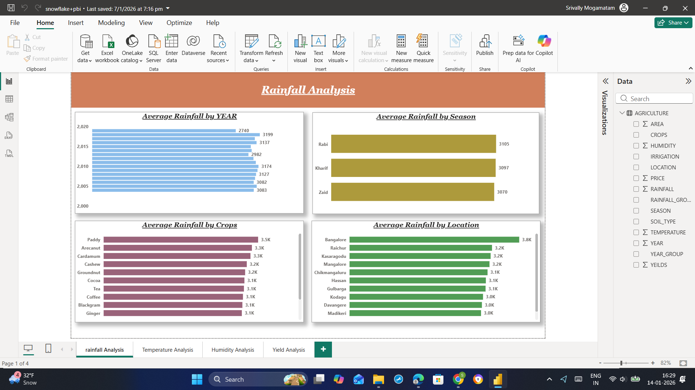
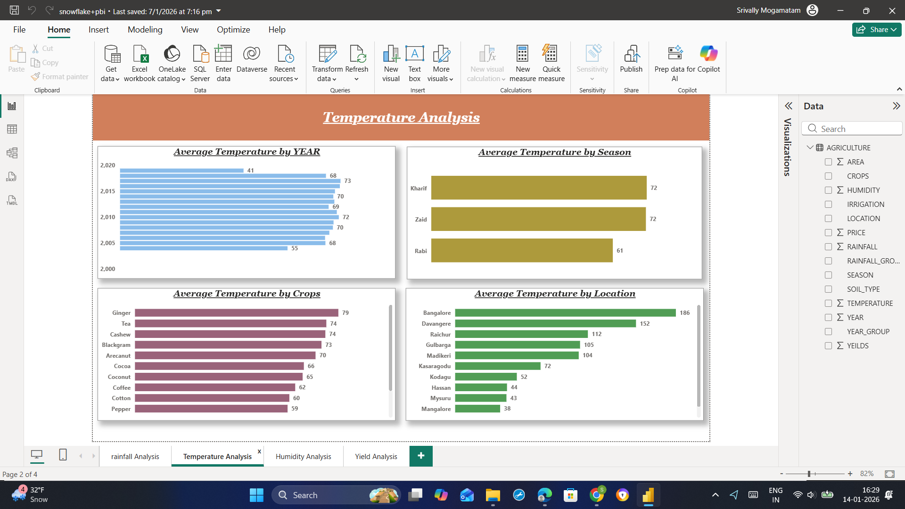
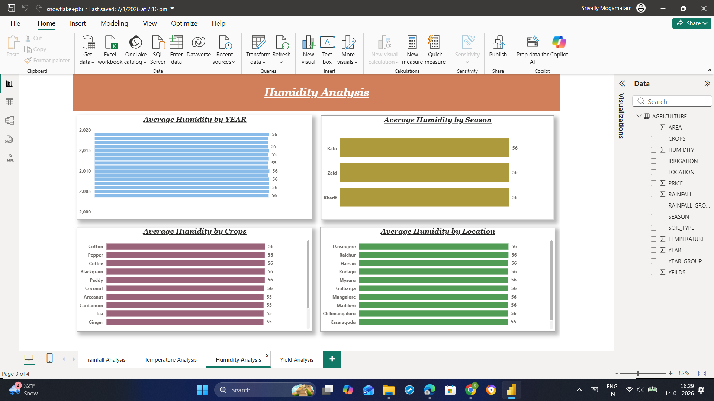
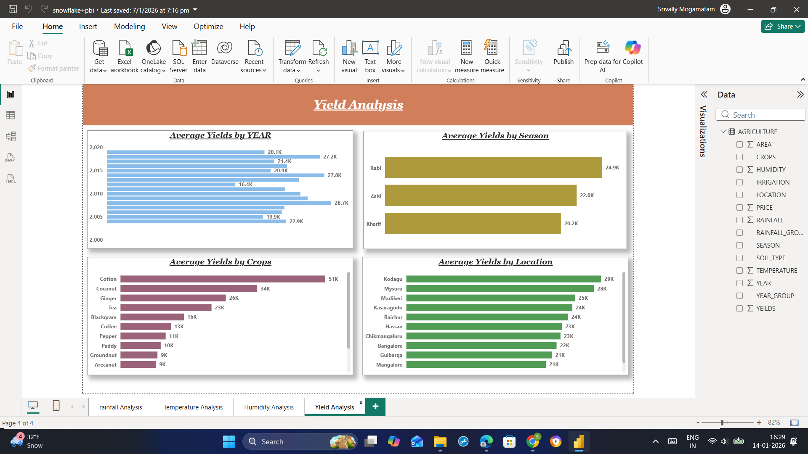

# Rainfall-Analysis-using-powerBI

# 🌾 Agriculture Climate & Yield Analytics Using Snowflake & Power BI

### 📊 Dashboard Link  
https://app.powerbi.com/groups/me/reports/e7966169-d67d-44f5-88ba-cf559908acd5/92fe95bcc83aa8810326?experience=power-bi

---

## 🧩 Problem Statement

Agricultural productivity is highly influenced by **rainfall, temperature, humidity, seasonality, crop type, and location**.  
This project analyzes agricultural data to understand how **climatic factors impact crop yield** across different years, seasons, crops, and regions.

The dashboard helps stakeholders:
- Monitor **climate trends over time**
- Compare **seasonal and regional variations**
- Identify **high-yield crops and locations**
- Support **data-driven agricultural planning and decision-making**

---

## 🛠 Tools & Technologies Used

- ❄️ Snowflake (Cloud Data Warehouse)
- SQL (Data Preparation & Analysis)
- 📊 Power BI Desktop
- Power BI Service
- Power Query Editor
- DAX (Measures & Calculations)

---

## 📂 Dataset Information

- **data_season.csv**
- Key attributes:
  - Year
  - Season (Rabi, Kharif, Zaid)
  - Crops
  - Location
  - Rainfall
  - Temperature
  - Humidity
  - Yield
  - Soil Type
  - Irrigation
  - Area

---

## 🔄 Data Preparation Using Snowflake

- Dataset was uploaded into **Snowflake**
- SQL was used to:
  - Validate schema and data types
  - Prepare clean analytical tables
  - Structure data for reporting
- Snowflake served as the **central data source** for Power BI

---

## 🔄 Power BI Data Cleaning (Power Query)

After importing data from Snowflake into Power BI:

- Verified and corrected **data types**
- Ensured numeric consistency for climate and yield fields
- Standardized categorical columns (Season, Crops, Location)
- Loaded clean data into the Power BI data model

---

## 📊 Dashboard Structure & Analysis Pages

The dashboard consists of **four analytical pages**, each focusing on a key agricultural dimension.

---

### 🌧️ Rainfall Analysis

- Average rainfall by **year**
- Average rainfall by **season**
- Crop-wise rainfall comparison
- Location-wise rainfall distribution

**Purpose:**  
Understand rainfall patterns and their variability across crops, seasons, and regions.

---

### 🌡️ Temperature Analysis

- Average temperature by **year**
- Average temperature by **season**
- Temperature trends across **crops**
- Location-wise temperature variation

**Purpose:**  
Analyze how temperature impacts agricultural conditions and crop suitability.

---

### 💧 Humidity Analysis

- Average humidity by **year**
- Average humidity by **season**
- Crop-wise humidity comparison
- Location-wise humidity distribution

**Purpose:**  
Evaluate humidity stability and its influence on crop growth.

---

### 🌾 Yield Analysis

- Average yield by **year**
- Average yield by **season**
- Crop-wise yield comparison
- Location-wise yield performance

**Purpose:**  
Identify high-yield crops and regions based on climatic conditions.

---

## 📸 Dashboard Snapshots

### Rainfall Analysis

### Temperature Analysis

### Humidity Analysis

### Yield Analysis

---

## 🔍 Key Insights

- Rainfall shows noticeable variation across seasons, with **Rabi season receiving higher averages**
- Certain locations consistently experience **higher rainfall and stable humidity**
- Temperature patterns vary significantly across crops and regions
- Crops such as **Cotton and Coconut** show higher average yields
- Regions like **Kodagu and Mysuru** demonstrate strong yield performance
- Climate consistency plays a major role in improving agricultural yield

---

## 🚀 Deployment

- Dashboard developed in **Power BI Desktop**
- Published to **Power BI Service**
- Data sourced directly from **Snowflake**

---

## ✅ Conclusion

This project demonstrates an **end-to-end agriculture analytics solution** using Snowflake and Power BI.  
It highlights how **cloud data warehousing, SQL analysis, and interactive dashboards** can be used to study climate impact on agricultural yield and support smarter farming strategies.

---

